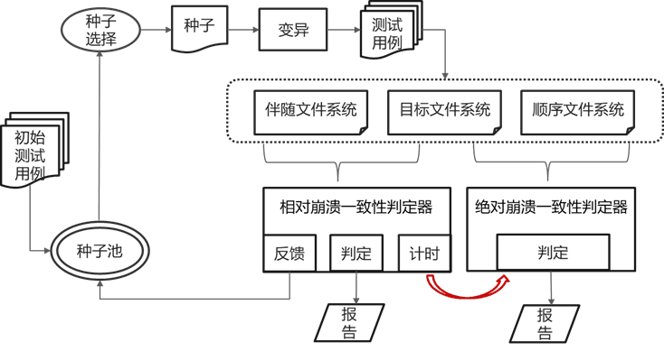

# Fuzzcc

## TODO

- [ ] 重构代码
    - [ ] 文件结构重整
    - [ ] 代码分模块重构
    - [ ] 改用多线程处理种子的生成与消费
        - python 多线程: https://docs.python.org/zh-cn/3/library/threading.html
        - [互斥锁解决 Python 中多线程共享全局变量的问题](https://zhuanlan.zhihu.com/p/259969195)
    - [ ] 更新README.md
- [ ] 从 ccserver.py 的 main 函数开始逐步重构
    - [ ] ccgenerator.py 中 JoinableQueue 改用 Queue

## 原理



- 多线程执行，进行种子生成和种子变异, 以此实现共享testcases

## 目录结构

```
.
├── ccgenerator.py    ----> 种子生成
├── ccinit.py
├── ccmounter.py
├── ccmutator.py      ----> 种子变异
├── ccparser.py
├── ccserver.py       ----> 主程序
├── ccsyscalls.py
├── cctools.py
├── crash-parse.py
├── fusetest.py
├── fuzzcc.py
├── globalVar.py
├── istat.py
├── logfiles/         ----> 日志目录
```

## Usage

```shell
usage: ccserver.py [-h] [-k IS_KERNEL_FS] [-t FS_TYPE]
```

- 程序入口: ccserver.py

```shell
$ python3 ccserver.py -k 0 -t specific
```

---

## Old Parts

### 已实现部分


    - globalVar.py: 一些常量（fs ops）和全局变量(seedqueue, testcasequeue)
    - ccgenerator.py: def ccgenerator(seq-length)根据给定的seq长度，生成种子
        - 如 ccgenerator(2) [ [[create, 'file1'], [sync]], ...]
            - ccgenerator(1) [[create, 'file2'],...]
        - 保存到seedqueue,和testcasequeue
    - ccmutator.py: 
        - 取出当前testcasequeue中的一个testcase,变异，生成的新testcase追加到testcasequeue

- ccparser.py -->取出每个testcase进行解析执行，识别testcase中的fs ops
    - ccsyscalls.py: ccparser.py调用ccsyscall将识别到的fs ops真正的执行

### 未实现的部分
- ccserver.py ---->初始化执行序列作为seed，执行变异，生成测试用例
    - 生成初始种子seedqueue 利用ccgenerator() 
    - 读取seedqueue，变异生成testcasequeue, 利用mutator
    - //以上这个需要多线程实现，共享seedqueue和testcasequeue
    - 对于testcasequeue的每一个testcase
      - 调用runner()
      - // runner()根据结果会将testcase加入到seedqueue中，也会把testcase从testcasequeue中删除，这俩都是动态的  
    - //(生成两个初始镜像，挂载两个目录，取testcase分别在两个目录下执行，将执行后的img进行比较，img不一致则报错)
    ------------ --------- 以下是runner()函数的逻辑---------------------------
    - makefile 生成初始镜像
        - 在specificfuse/xv6fs/makefile中,提供了一种make fs.img的方法
        - fs.img初始镜像只包含一个$FILE文件
        - 生成两个内容一样，命名不同的两个img：target.img 和 adjoint.img
    - ccmounter.py 
        - xv6fs用户态文件系统挂载：要分别挂载两个img到不同的挂载目录，作为目标文件系统和伴随文件系统
    - ccparser.py
        - 取全局变量testcasequeue中的一个testcase，在两个挂载目录分别执行
    - file_md5_hash()
        - 比较两个img是否存在不一致


## Usage

```shell
python3 istat.py -h

python3 istat.py -t U -i ../specificfuse/xv6fs/fs.img -p xv6fs -o xv6fs0308.istat

python3 ccserver.py -k (is_kernel_fs) -T (target img) -t (fs-type) 
```

